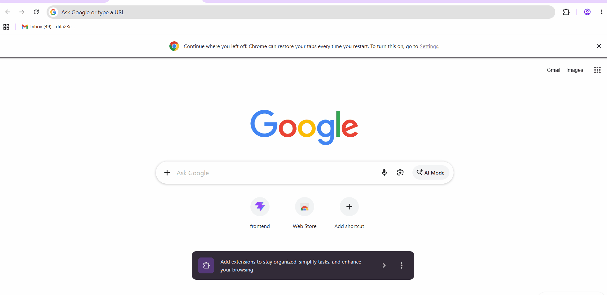

# AIFinder - AI Tool Discovery Platform

A full-stack web application for searching, filtering, and bookmarking AI tools. Powered by a Spring Boot REST API, MySQL Full-Text Search indexing, and a React frontend with persistent browser storage.

---

## What It Does

* **Keyword Search:** Uses MySQL Full-Text indexing to find tools based on names, categories, descriptions, or tags.
* **Pricing & Category Filters:** Narrow down results by Free, Freemium, or Paid tiers, along with dedicated category shortcuts.
* **Local Bookmarks:** Save tools directly in your browser using `localStorage` without needing an account.
* **Responsive UI:** Clean dark interface built with Tailwind CSS v4 and Lucide icons.

---

## Tech Stack

* **Frontend:** React 18, Vite, Tailwind CSS v4, Lucide React
* **Backend:** Java 17, Spring Boot 3, Spring Data JPA
* **Database:** MySQL 9.6 with InnoDB and `FULLTEXT` Search Index
* **API:** RESTful JSON endpoints with CORS enabled

---

## System Architecture & Data Flow

```text
┌──────────────────┐        HTTP / JSON        ┌──────────────────────┐        JPA / SQL        ┌──────────────────┐
│   React Client   │ ────────────────────────> │   Spring Boot API    │ ─────────────────────> │     MySQL DB     │
│   (Vite + UI)    │ <──────────────────────── │  (Controller/Service)│ <───────────────────── │ (FULLTEXT Index) │
└──────────────────┘       REST Responses      └──────────────────────┘       Data Queries      └──────────────────┘
```

The React frontend sends asynchronous requests using Axios to the Spring Boot REST API.

The backend processes search queries through MySQL's `FULLTEXT` index across the indexed columns:

* `name`
* `category`
* `description`
* `tags`

The API returns ranked search results to the React frontend, where they are displayed to the user.

---

## REST API Reference

### Get All AI Tools

```http
GET /api/tools
```

Fetches all AI tools stored in the database.

### Search AI Tools

```http
GET /api/tools/search?q={query}
```

Searches AI tools using MySQL Full-Text Search and relevance ranking.

### Filter by Category

```http
GET /api/tools/category/{name}
```

Returns AI tools belonging to the specified category.

### Add a New AI Tool

```http
POST /api/tools
```

Adds a new AI tool to the database.

---

## Local Setup

### Prerequisites

Make sure the following are installed:

* Java JDK 17+
* Node.js v18+
* MySQL Server 9.x
* npm

---

### 1. Database Setup

Log into MySQL and create the database:

```sql
CREATE DATABASE ai_finder_db;
USE ai_finder_db;
```

Make sure your MySQL username and password are configured in:

```text
backend/src/main/resources/application.properties
```

---

### 2. Backend Setup

Open a terminal and navigate to the backend folder:

```bash
cd backend
```

Run the Spring Boot application:

```bash
./mvnw spring-boot:run
```

On Windows, you can use:

```bash
mvnw.cmd spring-boot:run
```

The backend API will start on the configured Spring Boot port.

---

### 3. Frontend Setup

Open another terminal and navigate to the frontend folder:

```bash
cd frontend
```

Install the required dependencies:

```bash
npm install
```

Start the development server:

```bash
npm run dev
```

Vite will display the local frontend URL in the terminal.

---

## Project Structure

```text
AIFinder/
│
├── backend/
│   ├── src/
│   │   └── main/
│   │       ├── java/
│   │       │   └── com/
│   │       │       └── aifinder/
│   │       └── resources/
│   │           └── application.properties
│   │
│   └── pom.xml
│
├── frontend/
│   ├── src/
│   ├── public/
│   ├── package.json
│   └── vite.config.js
│
├── database/
│   ├── schema/
│   │   └── schema.sql
│   │
│   └── seed/
│       └── seed.sql
│
└── README.md
```

---

## Key Features

* 🔎 AI tool search
* 🏷️ Category-based filtering
* 💰 Pricing-based filtering
* ⭐ Local bookmarking
* ⚡ MySQL Full-Text Search
* 📊 Relevance-ranked search results
* 🔗 REST API architecture
* 📱 Responsive frontend
* 🌙 Dark-themed UI
* 🚀 React + Spring Boot full-stack architecture

---

## Search Flow

```text
User enters search query
          │
          ▼
     React Frontend
          │
          │ Axios Request
          ▼
    Spring Boot REST API
          │
          ▼
    Service / Repository
          │
          ▼
       MySQL Database
          │
          │ FULLTEXT Search
          ▼
 Ranked AI Tool Results
          │
          ▼
    Spring Boot API
          │
          ▼
     React Frontend
          │
          ▼
     Tool Cards / UI
```

---

## Future Enhancements

* User authentication and accounts
* Cloud-based bookmarks
* Advanced filtering and sorting
* AI-powered recommendations
* Tool ratings and reviews
* Pagination
* Admin dashboard
* Tool submission form
* Analytics and usage tracking
* More AI tool categories
* Improved search suggestions

---

## License

This project is developed for educational and portfolio purposes.
